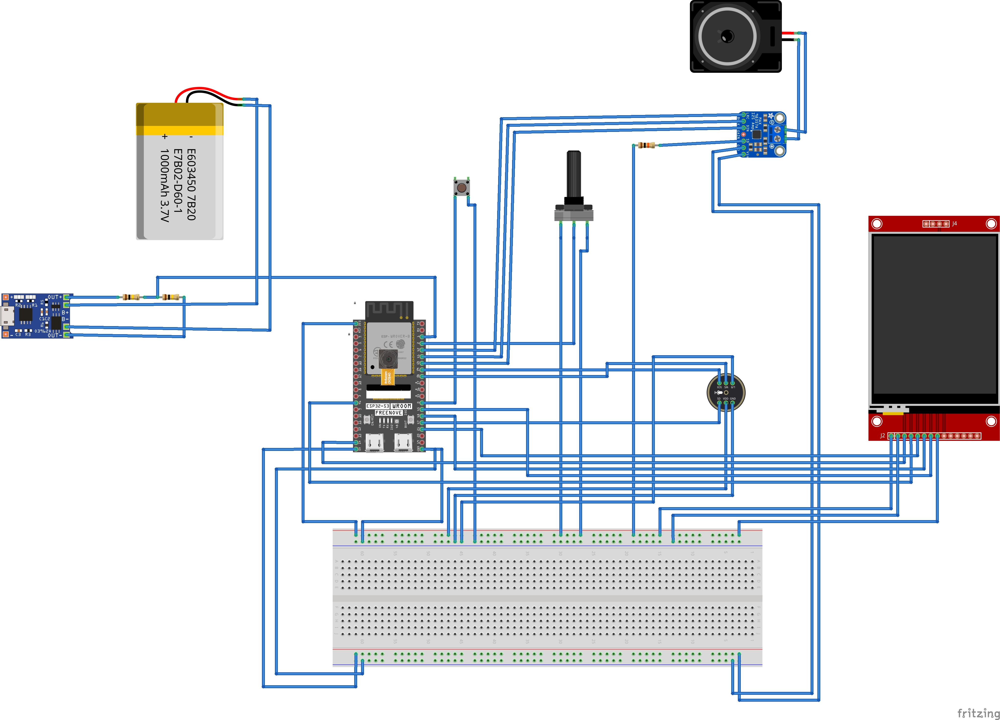
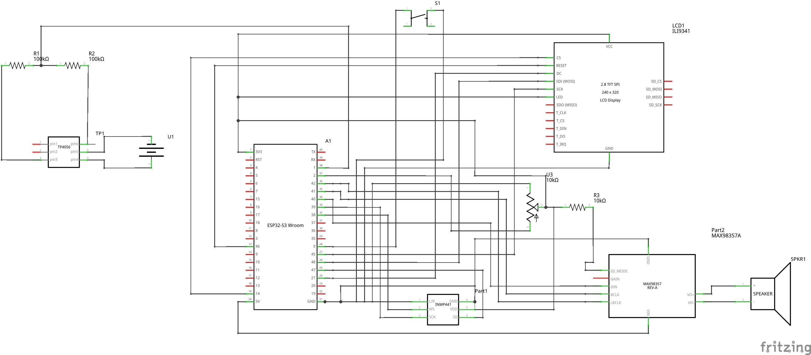

# NeuraLearn Hardware Design

This repository contains the electrical schematics, PCB layouts, and 3D enclosure designs for the NeuraLearn AI Tutor.

## Wiring Diagram (Breadboard)

## Schematics
For the full electrical logic, see the [Schematic PDF](schematics/exports/schematic_view.pdf).

## Component List
- **MCU:** Freenove ESP32-S3 (N16R8)
- **Audio:** MAX98357A (Amp) + INMP441 (Mic)
- **Vision:** OV2640
- **Display:** 2.4" TFT ILI9341
